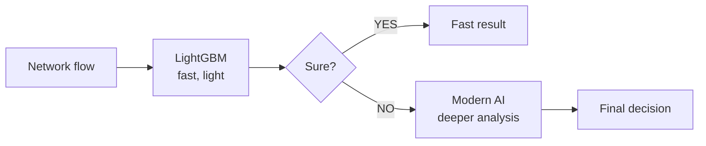
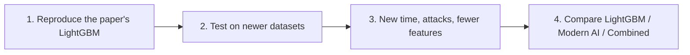

# Beyond 100% — Speaker Notes (6 slides, beginner-friendly)

**Deck:** `Beyond_100.pptx`: 6 slides, no notes inside the file.
**Time:** about 1.5 minutes per slide, roughly 9 minutes.
**Extra material:** `Beyond_100_Extended_13slides.pptx` has every figure from the paper (ROC curves, confusion matrices) if a judge asks to see them.

**The whole project in one sentence:** A recent IEEE paper says LightGBM detects network attacks very well, but its own numbers disagree and it was tested only on 1999 data, so we check it and add a "second look" for the cases where it is unsure.

---

## Words to know (also on slide 2)

| Word | Plain meaning |
|---|---|
| Network attack | Someone sending harmful traffic to break into or disrupt a network |
| Anomaly | Unusual traffic that does not look like normal use |
| Detector (IDS) | A program that watches traffic and flags attacks |
| Training | The practice questions the model learns from |
| Test | The exam: data the model has never seen |
| Accuracy | Share of answers that are right |
| Missed attack | A real attack the detector calls normal (costs money) |
| False alarm | Normal traffic the detector calls an attack (wastes analyst time) |
| LightGBM | A fast, popular model made of many small decision trees |

---

## Slide 1 — Title page

**On screen:** *Beyond 100%*; tagline "From high accuracy to reliable detection"; four fields: PROBLEM TITLE, IEEE PAPER, PAPER NUMBER, TEAM MEMBERS; buttons that open IEEE Xplore and the DOI. No statistics on this slide.

**Say (about 20 seconds):**
> "Good [morning/afternoon]. We are Mahidhar, Sasikanth and Harshith. Our project is *Beyond 100%: Testing and Improving ML-Based Network Attack Detection*. We reviewed the IEEE Access paper *Anomaly Detection in Network Traffic Using Advanced Machine Learning Techniques*, volume 13, pages 16133 to 16149, published in 2025."

| Field | Value | Status |
|---|---|---|
| Paper title, authors, volume, pages | as above | Confirmed on the paper's first page |
| DOI | 10.1109/ACCESS.2025.3526988 | Confirmed on the paper's first page |
| IEEE Xplore document number | 10833631 | From your link, and it matched an earlier search. I could not open IEEE Xplore from the build environment, so click the button once to confirm. |

---

## Slide 2 — What is this paper? (what, why, how)

**On screen:** the paper's title and a button to open it; its own Fig. 1; WHAT / WHY / HOW cards; words to know.

**Say:**
> "The paper is *Anomaly Detection in Network Traffic Using Advanced Machine Learning Techniques*, from IEEE Access, 2025. **What:** it tests seven machine-learning models on one job: is this traffic normal or an attack? **Why:** attackers keep changing tactics, so fixed rules fall behind, and models can learn from past traffic. **How:** it takes old traffic records called KDD'99, cleans them, trains each model on most of the data, tests on the rest, and compares the scores. LightGBM comes out as the winner."

| Fact | Where in the paper |
|---|---|
| 7 models: Isolation Forest, Naive Bayes, XGBoost, LightGBM, SVM, Random Forest, Logistic Regression | Abstract and Tables 5–7 |
| KDD'99 from Kaggle, 125,973 records | pp.16136, 16138 |
| Imputation, de-duplication, SMOTE, z-score, PCA | pp.16138–16139 |
| Accuracy, precision, recall, F1, ROC-AUC | p.16139 |

---

## Slide 3 — Can 100% accuracy be trusted? (paper numbers vs industry loss)

**On screen:** a split screen. **Left, "In the paper":** practice-vs-exam chart for all 7 models and three mini-stats. **Right, "In industry":** three loss numbers with clickable [n] sources. The bottom bar links the two.

**Say:**
> "Here is our question: can 100% accuracy be trusted? On the left are the paper's own numbers. Blue is accuracy on the practice data, orange is accuracy on the exam. Every model loses points, between 6 and 16. And look at LightGBM: the abstract says 1.00 on practice and 0.85 on the exam, but the paper's tables print it the other way round. From LightGBM's own confusion matrix we calculate about 15% of attacks missed and 12% of normal traffic falsely flagged. Why does that matter? On the right is the industry's side. IBM's 2026 report puts the average data breach at 4.99 million dollars, a record, and 247 days to find and contain one. The FBI logged 20.9 billion dollars in reported cybercrime losses in 2025. Every point lost on the exam is a missed attack or a false alarm in the real world, and that is where the money goes."

**Careful wording:**
- Say *"what failed defence costs"*. The IBM figure is the cost of a breach, not only of a missed detection.
- The FBI figure is *reported cybercrime losses* (mostly fraud). Do not call it "network attack losses".

| Number | Source |
|---|---|
| Train / test: IF 0.50/0.40, NB 0.89/0.81, XGBoost 0.99/0.83, LightGBM 1.00/0.85, SVM 0.99/0.85, RF 0.98/0.82, LR 0.81/0.75 | Table 5, abstract |
| LightGBM reported both ways | Abstract p.16133 (train 1.0, test 0.85) vs Tables 5, 6, 8 pp.16145–16147 (test 1.0, train 0.85) |
| 15% missed, 12% false alarms | **Our calculation** from Fig. 11: 10,101 of 67,343 attacks missed; 7,036 of 58,630 normal flows flagged |
| $4.99M average breach cost, record, +12%; 247 days to identify and contain | IBM / Ponemon, *Cost of a Data Breach Report 2026* [2] |
| $20.9B reported losses, +26%, over 1 million complaints | FBI IC3, *2025 Internet Crime Report* [3] |
| Security AI and automation cut breach cost by $1.93M on average | IBM 2026 [2] (used on slide 5) |

> Confirm: I found the industry figures through IBM's and the FBI's pages and news summaries of them, but could not open the IC3 PDF itself. Check the exact $20.9B (reported as $20.877B in summaries) in the PDF before you present.
> The "6–16 points" uses LightGBM as in the abstract (1.00 → 0.85 = 15).

---

## Slide 4 — What is the paper lacking?

**On screen:** six gap cards with page numbers.

**Say:**
> "Six gaps, none of them an accusation. One: the data is from 1999, and the paper itself says it is more than two decades old. Two: only one dataset, so nothing on a different network, a new time period or new attacks. Three: the numbers disagree for LightGBM. Four: the testing is unclear. One table says a 70/30 split, the text says 80/20, and the confusion matrices look built from rounded rates. Five: false alarms and speed are discussed but never measured. Six: the model always gives a yes or no and never says 'I'm not sure'."

| Gap | Evidence |
|---|---|
| Old data | p.16147: "more than two decades old" |
| One dataset | pp.16137, 16147 (newer datasets named as future work) |
| Numbers disagree | pp.16133, 16145, 16147; Table 8 uses 100% against CNN-LSTM 99.09% |
| Unclear testing | Table 2 "70%-30%" p.16138; "80:20" p.16140; matrices (Figs. 4, 5, 10, 11, 16) |
| No cost numbers | p.16146: false positives called "a significant problem"; latency left to future work |
| Never "not sure" | The method (Table 2) outputs a label for every flow |

**About "rounded rates" (our check):** every one of the 20 matrix cells equals class total × a two-decimal rate (e.g. 58,630 × 0.88 = 51,594), and each matrix totals 125,973, the whole dataset. Say *"look built from rounded rates"*, never "fabricated".

---

## Slide 5 — What are we solving?

**On screen:** flowchart; "why AI?" note; paper-vs-ours table; the goal.

**Say:**
> "We don't replace LightGBM. It's fast and light. Every network flow goes to LightGBM first. If it's sure, we accept the answer at once. If it's not, a modern AI model takes a deeper look. Compared with the paper, we add newer datasets, tests for new time periods, networks and attacks, a rule for when to ask for a second look, and scores that include missed attacks, false alarms and speed. IBM finds that security AI and automation cut breach costs by 1.93 million dollars on average. Our goal: a detector that knows when it is confident, and when it needs a second look."

---

## Slide 6 — How will we prove it? (and references)

**On screen:** four steps; what we will measure; tech stack (clickable); full reference list (clickable).

**Say:**
> "Step one: reproduce the paper's LightGBM and settle 1.00 versus 0.85. Step two: test on newer datasets such as CIC-IDS2017. Step three: test a new time period, new attack types and fewer features. Step four: compare LightGBM, a modern AI model and our combined approach. We'll measure accuracy, missed attacks, false alarms, speed, and how much traffic goes to the AI model. We have not run these yet, so no results are shown. Every source is on this slide and clickable."

### References (IEEE style)

1. S. Ness *et al.*, "Anomaly Detection in Network Traffic Using Advanced Machine Learning Techniques," *IEEE Access*, vol. 13, pp. 16133–16149, 2025. doi: [10.1109/ACCESS.2025.3526988](https://doi.org/10.1109/ACCESS.2025.3526988)
2. IBM and Ponemon Institute, "Cost of a Data Breach Report 2026." <https://www.ibm.com/think/x-force/2026-cost-of-a-data-breach-ai-adversaries-enterprise-risk>
3. FBI Internet Crime Complaint Center, "2025 Internet Crime Report." <https://www.ic3.gov/AnnualReport/Reports/2025_IC3Report.pdf>
4. "KDD Cup 1999 Data," UCI Machine Learning Repository. <https://archive.ics.uci.edu/dataset/130/kdd+cup+1999+data>
5. G. Ke *et al.*, "LightGBM: A Highly Efficient Gradient Boosting Decision Tree," NeurIPS, 2017. <https://proceedings.neurips.cc/paper/2017/file/6449f44a102fde848669bdd9eb6b76fa-Paper.pdf>
6. Canadian Institute for Cybersecurity, "Intrusion Detection Evaluation Dataset (CIC-IDS2017)," Univ. of New Brunswick. <https://www.unb.ca/cic/datasets/ids-2017.html>

---

## 30-second answer

> "A recent IEEE Access paper compared seven machine-learning models for spotting network attacks and picked LightGBM. But it tested only on 1999 data, and its own numbers disagree: 1.00 versus 0.85. Attacks cost industry millions, so a score we can't trust is risky. We check the result on newer traffic, then add a second look: LightGBM answers the easy cases, and a modern AI model handles the ones it's unsure about."

## Likely questions

| Question | Short answer |
|---|---|
| Are you saying the authors made a mistake? | No. We say the paper reports two numbers and tested on one old dataset, so we reproduce and test it ourselves. |
| What is the "industry loss"? | What failed defence costs: $4.99M per breach on average (IBM 2026) and $20.9B reported cybercrime losses (FBI 2025). |
| Do you have results? | Not yet. Slide 6 is the plan; no results are claimed. |
| Why keep LightGBM? | It is fast, light and good on tabular network data. We add a second look only for hard cases. |
| How does it know it is "unsure"? | LightGBM gives a probability. If it is low or close to 50/50, we ask the AI model. We will calibrate this. |
| What if LightGBM is already great on new data? | Then we learn why, and check whether the AI step is worth its cost. That is still a result. |
| Why not test on KDD'99 over time? | Its files have no timestamps, so time tests use newer datasets such as CIC-IDS2017. |

## Still to confirm yourself

1. **IC3 exact figure** (see the slide 3 note).
2. **Which Kaggle file the authors used.** 125,973 rows matches the NSL-KDD training file, where the 67,343 rows are *normal*, not "attack" as the paper says (p.16138). Check before saying it aloud; it is not on the 6 slides.
3. **LightGBM 1.00 vs 0.85:** the abstract and Fig. 12 say train 1.00 / test 0.85. Tables 5, 6, 8 say test 1.00. Keep saying "reported two ways", not "wrong".

---

## Visuals

- **Navigation:** the six dots in the footer jump to each slide. The [n] markers, the "Open paper" button and the tech-stack chips open their links (internet needed).
- **Paper figure:** slide 2 uses the paper's own Fig. 1 (CC BY 4.0, attributed in the footer). The chart on slide 3 and the tables are native and editable.
- **Icons:** generic glyphs, not official logos. No animations.
- **Fonts:** Cambria (titles) and Calibri (body).
