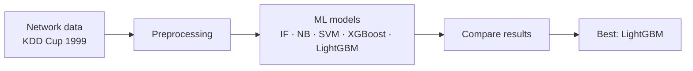
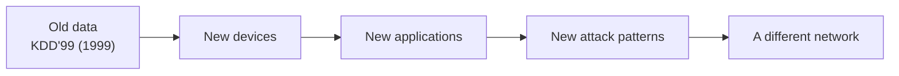
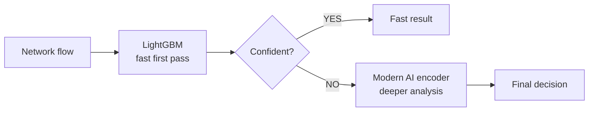
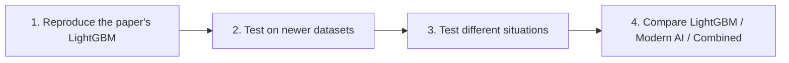

# Beyond 100% — Speaker Notes

**Deck:** `Beyond_100.pptx` (6 slides, no notes inside the file)
**Time:** about 1.5 minutes per slide, roughly 9–10 minutes in total, plus questions.
**Paper:** S. Ness et al., *Anomaly Detection in Network Traffic Using Advanced Machine Learning Techniques*, IEEE Access, vol. 13, pp. 16133–16149, 2025.

**One-line story:** The paper says LightGBM detects attacks very well. We ask whether it still works when the network data changes. If it doesn't, can a modern AI model make it more reliable, used only when needed?

---

## Verify before you present

These items come from search summaries of the paper's abstract and from your own reading. I could not open IEEE Xplore from the build environment, so **check them against the paper itself**.

| # | What the slides say | Where it comes from | Action |
|---|---|---|---|
| 1 | LightGBM **training accuracy 1.00**, **test accuracy 0.85** | The abstract (summaries agree) | Open the results table. Confirm which split the 1.00 belongs to. If the body says 100% *test* accuracy, slide 1 changes, and the inconsistency itself becomes your hook. |
| 2 | Models: Isolation Forest, Naive Bayes, SVM, XGBoost, LightGBM | The abstract lists these five | Your audit also mentioned Random Forest and Logistic Regression. Add them to slide 2 only if the body confirms. |
| 3 | Dataset: KDD Cup 1999 | Your audit | Confirm. |
| 4 | 80:20 split, 5-fold CV, F1/precision/recall figures | Your audit (not on the slides) | Confirm before quoting anywhere. |
| 5 | DOI 10.1109/ACCESS.2025.3526988 | Your audit (not on the slides) | Confirm on IEEE Xplore. |

Do not say "the authors made an error". Say: **"the paper's own numbers show a gap, so we test further."**

---

## Slide 1 — Can 100% Accuracy Be Trusted?

**On screen:** question title; 1.00 → 0.85; the 15-point gap; our question.

**Say:**
> "Network attacks keep getting harder to spot, and machine learning can help. This IEEE Access paper compared several ML models. LightGBM looked like the winner: its training accuracy is 1.00. But its test accuracy is 0.85. That's a 15-point gap, on the paper's own dataset. So I asked a bigger question: if the score drops this much on the same dataset, what happens on new and different network traffic?"

**Transition:** "So first, what exactly did the paper do?"

**If asked "isn't a train/test gap normal?":** Yes, some gap is normal. We treat it as a signal worth testing, not as proof of failure.

---

## Slide 2 — What Did the Paper Do?

**On screen:** paper card, KDD Cup 1999, five models, five-step workflow, main finding.

**Say:**
> "The authors took network data from KDD Cup 1999, preprocessed it, and compared five models: Isolation Forest, Naive Bayes, SVM, XGBoost and LightGBM. They compared the results and LightGBM came out best. It's a clean, simple experiment, and that's why it's a good one to build on."

**Transition:** "But everything here happens inside one dataset."

---

## Slide 3 — Where Is the Problem?

**On screen:** old data → new devices → new applications → new attack patterns → a different network; four open questions; the research gap.

**Say:**
> "KDD'99 comes from 1999. Real networks keep changing: new devices, new applications, new attack patterns. So the paper can't tell us four things. Does it work on newer datasets? On a different network? On new types of attacks? And what if some important features are missing? Our research gap in one sentence: high accuracy on one dataset does not prove the model works on different network traffic."

**Pause here.** This is the sentence you want the judges to remember.

---

## Slide 4 — Our Idea: Beyond 100%

**On screen:** flowchart (network flow → LightGBM → Confident? → fast result, or modern AI → final decision); simple versus difficult cases; why LightGBM first.

**Say:**
> "We don't replace LightGBM. It's fast, lightweight, and built for network-flow data. We make it smarter. LightGBM looks at every flow first. If it's confident, we accept the answer immediately. If it isn't, we pass that flow to a modern AI model for deeper analysis. Easy cases stay cheap, and the expensive model only runs on hard cases."

**If asked "why not use the modern model for everything?":** It costs more per flow. The idea is to spend that compute only where LightGBM is unsure.

---

## Slide 5 — How Will We Prove It?

**On screen:** four steps; five-test table; the three systems we compare; metrics; tech stack (the chips are clickable and open each tool's docs). The yellow tag says no results are claimed yet.

**Say:**
> "Step one: reproduce the paper's LightGBM result. Step two: test on newer datasets. Step three: test different situations: a new time period, new attack types, and removed features. Step four: compare LightGBM, a modern AI model, and our combined approach, on accuracy, precision, recall, F1, false alarms and speed. We have not run these yet, so we show no results. We show the plan."

**If asked "what if LightGBM generalizes fine?":** That is still a result. Then the question becomes *why* it generalizes, and whether the modern model is worth its cost. A negative result is a valid finding.

---

## Slide 6 — From High Accuracy to Reliable Detection

**On screen:** goal sentence; expected benefits (marked "to validate"); applications; future work.

**Say:**
> "Our goal is a detector that knows when it is confident, and knows when it needs deeper analysis. If this works, we expect better performance on new traffic, fewer false alarms, and deeper analysis only when it's necessary. These are hypotheses, and the experiments will test them. It could apply to enterprise, data-centre, cloud and IoT networks. Accuracy alone isn't enough."

---

## 30-second answer for "Explain your project simply"

> "We started with an IEEE paper that compared machine-learning models for network attack detection. LightGBM performed best on the old KDD'99 dataset, with 1.00 training accuracy but 0.85 test accuracy. KDD'99 is old, and the paper doesn't show whether the model works on new traffic. So we reproduce the paper and test it under different conditions. Then we propose a two-step system: LightGBM handles easy traffic quickly, and a modern AI model is used only when LightGBM is uncertain. Our goal is not just high accuracy, but reliable detection when the network changes."

---

## Likely questions

| Question | Short answer |
|---|---|
| Do you have results? | No. This is an idea-to-implementation plan, and the experiments are listed on slide 5. |
| Why LightGBM? | It's the paper's best model, it's fast, and it suits tabular flow data. It's the baseline we extend. |
| Isn't the transformer already used for intrusion detection? | Yes, and we don't claim novelty there. Our question is whether a modern model improves *reliability under change*, and at what compute cost. |
| How do you decide "confident"? | A calibrated probability threshold from LightGBM. Calibration and the threshold are tuned in the planned experiments. |
| KDD'99 has heavy duplicates. | Correct. The first phase is a data audit for duplicates and leakage before any modelling. |
| The feature sets differ between datasets. | We use a common feature subset for the KDD-to-modern test. We also test a cleaner pair that uses the same feature extractor (CICIDS2017 and CSE-CIC-IDS2018). |
| Can you test a time shift on KDD'99? | No: its standard files have no timestamps. We run the time-shift test on a dataset that has them (CICIDS2017 by day, or UNSW-NB15). |
| What if the gate isn't reliable? | That is the key risk. If LightGBM is confidently wrong on shifted data, nothing is escalated. We measure this *before* building the second stage. |
| Isn't a second model just "any second opinion"? | We add a control: compare against a plain second model, so we can tell whether "modern" matters. |

---

## Implementation roadmap (for Q&A or a backup slide)

| Phase | What | Decision gate |
|---|---|---|
| 0. Data audit | Duplicates, near-duplicates, leakage, feature alignment | Fix the splits before modelling |
| 1. Reproduce | The paper's LightGBM setup on KDD'99 | Do we match the reported numbers? |
| 2. Break it | New time period, new dataset, held-out attack family, removed features | Large drop, or does it hold? |
| 3. Gate analysis | Calibration and confidence of LightGBM on shifted data | Is its confidence usable as a gate? |
| 4. Escalate | Second stage on uncertain flows only, plus the control model | Does it beat the control per unit of compute? |

**Evaluation matrix (fill in only after running):**

| Evaluation | LightGBM | Modern AI | Combined |
|---|---|---|---|
| Same dataset (random split) | | | |
| New time period | | | |
| New dataset | | | |
| Unseen attack type | | | |
| Reduced features | | | |

---

## Diagram sources (Mermaid)

These match the diagrams drawn natively on slides 2–5. Paste them into any Mermaid renderer or GitHub Markdown.

**Slide 2 — what the paper did**

**Slide 3 — why the problem appears**

**Slide 4 — our idea**

**Slide 5 — how we will prove it**

---

## About the deck's visuals

- **Navigation:** the six numbered dots in the footer jump to that slide when clicked in slideshow mode.
- **Tech-stack chips (slide 5):** each opens that tool's documentation. This needs internet at the venue, so don't rely on it live.
- **Icons:** generic glyphs, not official brand logos. To use official logos, drop them in over the icon circles in PowerPoint.
- **Diagrams:** all workflow diagrams are native PowerPoint shapes, so they are fully editable. No animations were added.
- **Fonts:** Cambria (titles) and Calibri (body).
