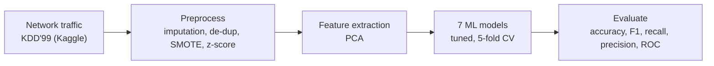
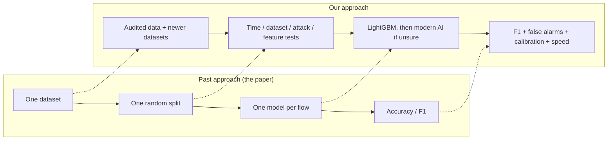
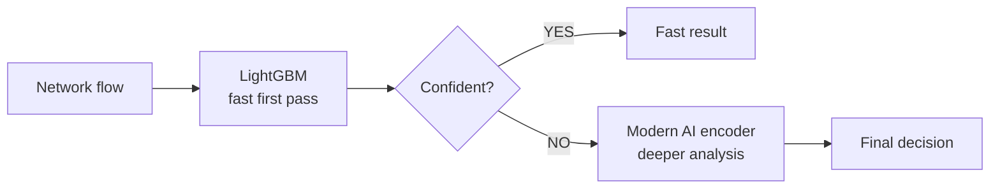
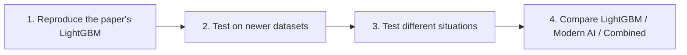

# Beyond 100% — Speaker Notes (v2, audited against the full paper)

**Deck:** `Beyond_100.pptx` — 13 slides, no notes inside the file.
**Paper:** S. Ness, V. Eswarakrishnan, H. Sridharan, V. Shinde, N. V. P. Janapareddy, V. Dhanawat, *Anomaly Detection in Network Traffic Using Advanced Machine Learning Techniques*, IEEE Access, vol. 13, pp. 16133–16149, 2025. **DOI 10.1109/ACCESS.2025.3526988** (confirmed on the paper's first page). Received 9 Dec 2024, accepted 31 Dec 2024, published 8 Jan 2025.
**Licence:** the paper is CC BY 4.0, so its figures are reused with attribution (each figure slide says so in the footer).

**One-line story:** The paper says LightGBM detects attacks very well, but its own pages disagree on LightGBM's accuracy. We audit it, then ask whether the result survives new traffic, and propose LightGBM first with a modern AI model only when LightGBM is unsure.

**Timing:** slides 1–10 are the talk (about 1 minute each, 10–12 minutes). Slides 11–13 are an appendix for questions. **Short slot (about 6 minutes):** use slides 1, 4, 5, 7, 8, 9.

---

## What the full-paper audit changed in the first version of this deck

| First version said | The paper actually says | Fixed on |
|---|---|---|
| LightGBM train 1.00 → test 0.85 "as reported" | **Both ways.** Abstract, Introduction, Fig. 12, Conclusion say train 1.0 / test 0.85. Results text, Tables 5, 6, 8 say test 1.0 / train 0.85. | Slides 1, 4 |
| 5 models | **7 models** in the results (Random Forest and Logistic Regression too) | Slide 2 |
| "Best: LightGBM" | Only true under the 100% reading. The Conclusion says SVM attained the same 0.85. | Slide 2 |
| KDD'99 is old (our view) | The paper says so itself (p.16147) and suggests CICIDS and NSL-KDD for future work | Slides 3, 9 |

---

## Verified facts (with page numbers)

| Claim | Where |
|---|---|
| LightGBM "near-perfect training accuracy (1.0) and solid test accuracy (0.85)" | Abstract, p.16133 |
| "training accuracy of 1.0 and test accuracy 0.85" | Introduction, p.16134 |
| Fig. 12 bars: train ≈1.00, test ≈0.85; Fig. 13 AUC train 1.00 / test 0.98 | pp.16143–16144 |
| "test accuracy of 1.0 and train accuracy of 0.85"; "perfect test accuracy at 100%" | Results text, pp.16143–16144 |
| Table 5: LightGBM Test 1.0, Train 0.85, F1 0.85, Recall 0.85, Precision 0.88 | p.16145 |
| Table 6: LightGBM 100.0%, 95% CI [99.8, 100.0] | p.16145 |
| Table 8: "Our Study LightGBM 100.00 accuracy, 85.00 F1" vs CNN-LSTM 99.09 / 99.10 and GRU 97.80 / 97.60 | p.16147 |
| Conclusion: "LightGBM's highest test accuracy was ... 0.85"; "SVM ... the same as LightGBM ... 0.85" | p.16147 |
| Table 2 says train-test split "70%-30%"; text says "80:20" with 5-fold CV | pp.16138, 16140 |
| Positive class (attack) 67,343; negative (normal) 58,630 (total 125,973) | p.16138 |
| SMOTE used "because of the KDDCup99 dataset's class imbalance" | pp.16138–16139 |
| Table 2 step 7: soft-voting ensemble; no ensemble result is reported | p.16138 |
| Hardware: Windows 11, Intel i7-6600U @ 2.60 GHz | p.16136 |
| "now more than two decades old"; recommends CICIDS and NSL-KDD | p.16147 |
| False positives called "a significant problem"; latency and inference time left to future work | p.16146 |

## Our own calculations (show them as "our calculation")

All from the numbers printed in the paper's confusion matrices (Figs. 4, 5, 10, 11, 16):

| Model | Wrong | Implied accuracy | Reported test | Normal flows flagged (false alarms) |
|---|---|---|---|---|
| Isolation Forest | 86,724 | 31.2% | 0.40 | 79% |
| Naive Bayes | 22,762 | 81.9% | 0.81 | 17% |
| XGBoost | 18,397 | 85.4% | 0.83 | 13% |
| LightGBM | 17,137 | 86.4% | 0.85 or 1.00 | 12% (7,036 of 58,630) |
| SVM | 16,464 | 86.9% | 0.85 | 12% |

- **Every one of the 20 matrix cells equals class total × a two-decimal rate**, with zero residual (for example 58,630 × 0.88 = 51,594). Real predictions land on such round rates in a given cell with a probability of roughly half a percent. So the matrices look built from rounded rates, not computed from model predictions.
- That also explains why LightGBM's and SVM's matrices share the same Normal-class counts (51,594 and 7,036): both have a 0.88 / 0.12 split.
- **Matrix totals are 125,973**, the whole dataset, not the ~25,195 rows of a 20% test split.
- **Recall check:** for six models, Table 5's recall is within 0.01 of test accuracy. LightGBM is the only exception (recall 0.85 vs "test accuracy" 1.0). The matrix's attack-class recall for LightGBM is exactly 0.850.
- **Train-to-test drop:** 0.06 to 0.16 for every model (Table 5, with LightGBM per the abstract at 0.15). Under Reading B, LightGBM's test accuracy would be 15 points *above* its training accuracy.
- *Minor, rough:* the widths of Table 6's confidence intervals imply a test set of about 2,000–3,000 rows if binomial, versus ~25,000 for a 20% split. This is a back-of-envelope estimate, so keep it out of the talk.

## Still to confirm yourself

1. **Which Kaggle file?** 125,973 rows matches the NSL-KDD training file, whose 67,343 rows are *normal*, whereas the paper calls 67,343 "attack". Open the Kaggle file the authors cite and check. Slide 6 marks this "TO CONFIRM". Do not say it as fact until you have checked.
2. **Other small inconsistencies** (not on slides): the Conclusion says "Naive Bayes has the highest test accuracy, 0.81", but XGBoost (0.83) and SVM (0.85) are higher. Table 5 prints SVM recall as "0..86". Fig. 6 shows Naive Bayes train accuracy about 0.90 while the text says 0.89.

**How to talk about it (important):** say *"the paper's own pages report two different numbers"* and *"the matrices look built from rounded rates"*. Do **not** say the authors made errors or fabricated anything. Say: *"this motivates an independent, audited reproduction."*

---

## Slide-by-slide script

### 1 — Can 100% Accuracy Be Trusted?
**On screen:** the two readings of LightGBM's accuracy; our question.
> "Machine learning can help spot attack traffic. A recent IEEE Access paper tested seven models and picked LightGBM as the winner. But look at LightGBM's accuracy in that same paper. In the abstract, it's 1.00 on training data and 0.85 on test data. In the results tables, it's the other way round: 0.85 training, 1.00 test. So which number is right? And does it hold on new network traffic?"

### 2 — What Did the Paper Do?
**On screen:** the paper's own Fig. 1; data, preparation, models, tuning, metrics; "reported winner".
> "The authors took the KDD'99 data from Kaggle, about 126 thousand records, cleaned it, balanced it with SMOTE, scaled it, and compressed it with PCA. They compared seven models, tuned them, and scored them on accuracy, F1, recall and precision. LightGBM is called the winner, though the Conclusion says SVM matches it at 0.85."

### 3 — What Did the Paper Report?
**On screen:** the paper's five train/test bar charts, Table 5.
> "These are the paper's own charts. Blue is training, green is test. Every model drops from training to test, by 6 to 16 points, even on the paper's own data. Notice LightGBM's row in Table 5 is the reverse of its chart."
**Aside:** four of five y-axes start at 0.70, which makes gaps look bigger. Links at the top right open the appendix.

### 4 — Audit 1: Same Model, Two Accuracy Numbers
**On screen:** Reading A vs Reading B with page numbers; the recall chart.
> "Reading A says test 0.85. Reading B says test 1.00. The recall chart is a tie-breaker. For six models, recall is about equal to test accuracy. For LightGBM alone it isn't: 0.85 versus 1.00. And Table 8 uses the 100% figure to say LightGBM beats a CNN-LSTM at 99.09%."

### 5 — Tie-Breaker: The Paper's Own Confusion Matrices
**On screen:** Fig. 11; implied-accuracy table; two callouts.
> "If LightGBM had 100% accuracy, its confusion matrix would have no errors. The paper's matrix shows 17,137 errors, about 86% accuracy. And every number in these matrices is the class total times a two-decimal rate, which real predictions almost never produce. So these matrices aren't independent proof. But even they point to about 0.86, not 1.00. Only an independent reproduction can settle it."

### 6 — Audit 2: Questions the Setup Leaves Open
**On screen:** six cards.
> "Six open questions: which split, why SMOTE on balanced data, which dataset file, an ensemble that's never reported, a cross-study comparison that mixes setups, and no deployment evidence. They're questions, not accusations."

### 7 — Past Approach vs Our Approach
**On screen:** comparison table, "+" marks what we add.
> "The paper asked which model scores best. We ask whether the best model stays reliable when traffic changes. We keep its data and methods as the baseline, then add: an audited split, newer datasets, time, new-attack and missing-feature tests, false-alarm and speed metrics, and a confidence gate."

### 8 — Our Idea: Beyond 100%
**On screen:** flowchart.
> "LightGBM looks at every flow first, because it's fast. If it's confident, we accept. If not, a modern AI encoder takes a deeper look. Easy cases stay cheap; the expensive model runs only on hard ones."

### 9 — How Will We Prove It?
**On screen:** four steps; five tests; metrics; tech stack (chips open docs).
> "Step one: reproduce the paper and settle 1.00 versus 0.85. Step two: newer datasets. Step three: different situations. Step four: compare LightGBM, a modern AI model and the combination. We show no results yet. This is the plan."

### 10 — From High Accuracy to Reliable Detection
> "The goal is a detector that knows when it is confident and when it needs deeper analysis. The benefits listed are hypotheses to validate. Accuracy alone isn't enough."

### Appendix (slides 11–13, use for questions)
- **11 ROC curves:** test AUC 0.98 for XGBoost, LightGBM, SVM yet accuracy only 0.83–0.85. The ranking is good but the default threshold may not carry over, which is a calibration question. (Our interpretation.)
- **12 Confusion matrices:** the false-alarm rates computed from them (12% for LightGBM), which the paper never reports.
- **13 Comparison charts and Tables 6–8:** the confidence interval and p-values are built on the disputed 100% figure; Table 8 compares with other papers' own results.

---

## 30-second answer

> "A recent IEEE Access paper compared seven ML models for network attack detection and picked LightGBM. But the paper reports LightGBM's accuracy two ways, 1.00 test in the tables and 0.85 test in the abstract, and its confusion matrices point to about 0.86. So we reproduce it properly, test it on new traffic, and propose LightGBM first with a modern AI model only when LightGBM is unsure. Our goal is reliable detection, not just a high score."

## Likely questions

| Question | Short answer |
|---|---|
| Are you saying the authors made a mistake? | No. We say the paper reports two numbers, and an independent reproduction is the way to settle it. |
| Do you have results? | No. This is an idea-to-implementation plan; slide 9 is the evaluation plan. |
| Isn't a train/test gap normal? | A gap is normal. A 15-point gap plus contradictory reporting is what we want to reproduce. |
| Why LightGBM as the base? | It's the paper's headline model, it's fast, and it suits tabular flow data. |
| Isn't a transformer already used in intrusion detection? | Yes. We don't claim novelty there; we test whether it improves reliability under change, at what cost. |
| How do you decide "confident"? | A calibrated probability threshold from LightGBM; calibration is part of the plan. |
| What if the gate is unreliable? | That's the key risk. If LightGBM is confidently wrong on shifted data, nothing is escalated. We measure this before building the second stage. |
| Can you test a time shift on KDD'99? | No, the standard files have no timestamps. We use a dataset that has them (e.g. CICIDS2017 by day, UNSW-NB15). |
| Why not just use one newer dataset? | Feature sets differ between datasets, so we use a common feature subset, plus a pair that share a feature extractor (CICIDS2017 and CSE-CIC-IDS2018). |
| What if LightGBM turns out to generalise fine? | That's still a result: then the question becomes why, and whether the second stage is worth its cost. |

## Phases (backup)

| Phase | What | Decision gate |
|---|---|---|
| 0. Data audit | Duplicates, leakage, which file, split before preprocessing | Fix the splits before modelling |
| 1. Reproduce | The paper's LightGBM, under both readings | Which number holds? |
| 2. Break it | New period, new dataset, unseen attack, fewer features | Large drop, or does it hold? |
| 3. Gate analysis | Calibration and confidence under shift | Is confidence usable as a gate? |
| 4. Escalate | Second stage on uncertain flows, with a plain second-model control | Does it beat the control per unit of compute? |

**Evaluation matrix (fill only after running):**

| Evaluation | LightGBM | Modern AI | Combined |
|---|---|---|---|
| Same dataset (audited split) | | | |
| New time period | | | |
| New dataset | | | |
| Unseen attack type | | | |
| Reduced features | | | |

---

## Diagram sources (Mermaid)

**Slide 2 — the paper's pipeline**

**Slide 7 — past vs our approach**

**Slide 8 — our idea**

**Slide 9 — the plan**

---

## About the deck's visuals

- **Navigation:** the numbered dots in the footer jump to that slide in slideshow mode. The pills on slide 3 link to the appendix, and the appendix slides link back.
- **Tech-stack chips (slide 9):** open each tool's docs. This needs internet at the venue.
- **Figures** on slides 2–5 and 11–13 are the paper's own, unaltered; the charts on slides 4 and 12 and the tables on slides 3 and 5 are native and editable.
- **Icons:** generic glyphs, not official logos. To use official logos, drop them over the icon circles.
- **Fonts:** Cambria (titles) and Calibri (body). No animations were added.
